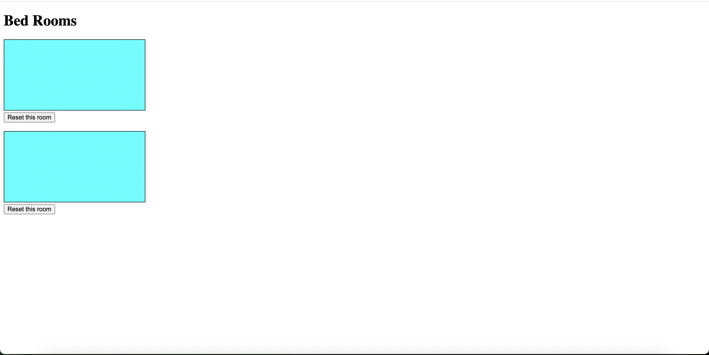
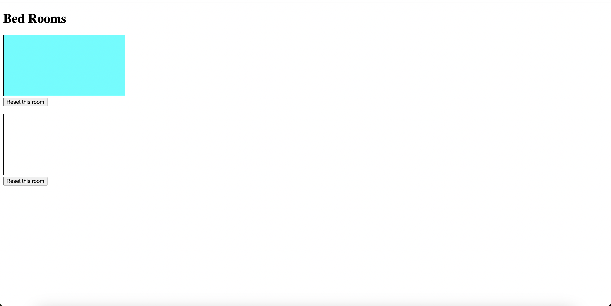
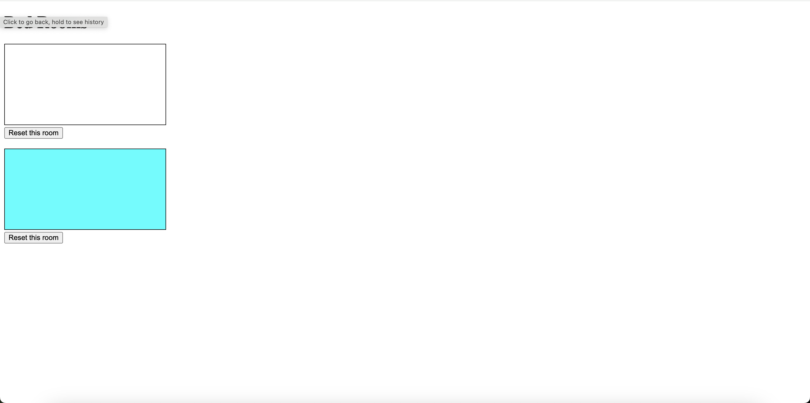
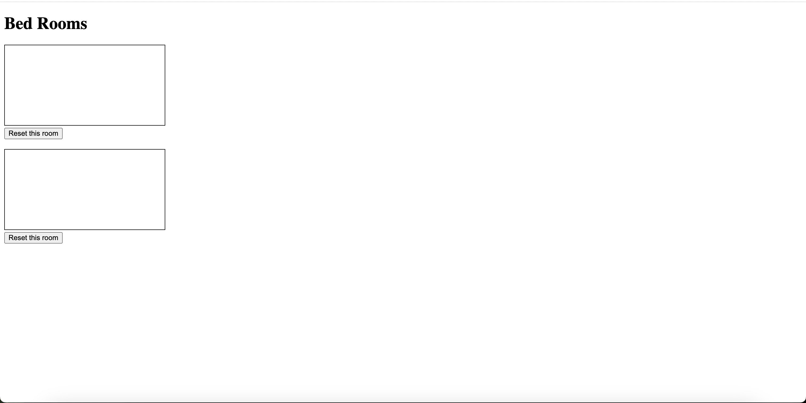

# Running server
  - To run server just type `node server.js`
# To see the code of hardware reffer
  - https://github.com/reinnatan/ButtonPressedWebSocket
# Screenshhot Dasbboard screen when all button pressed
  
# Screenshots Dasbboard screen one of button pressed
  
  
# Screenshot Dasbboard reset button pressed
  
